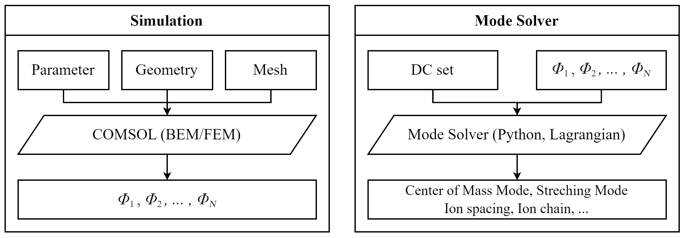
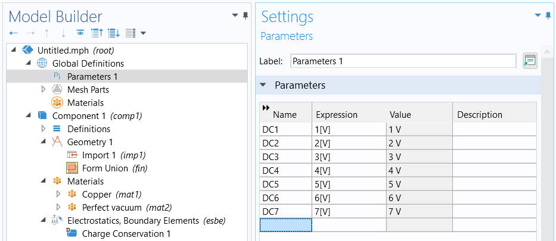
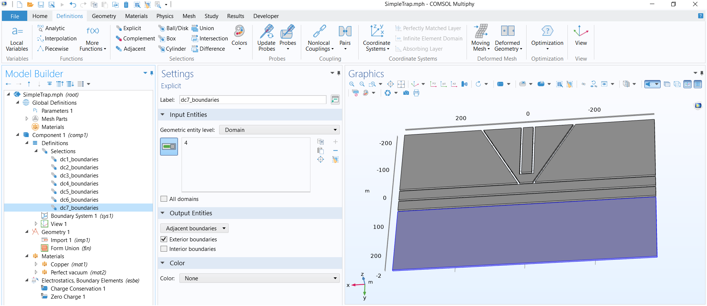
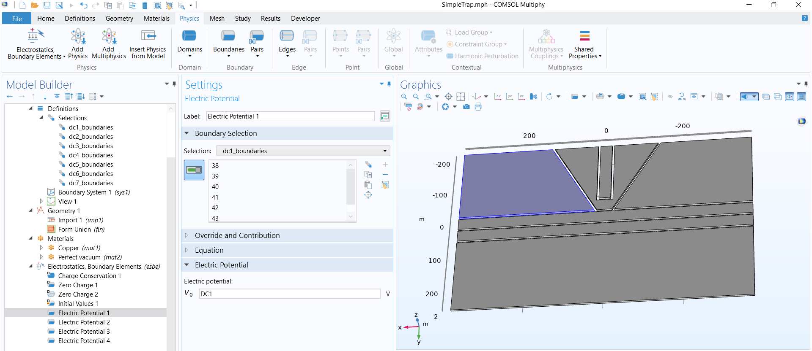

# bem-comsol

bem-comsol is a python package that can simulate electrostatics for ion traps using boundary element method provided by COMSOL Multiphysics. It also provides a tool to analyze 1D electric potential and find the eigenmodes.



The diagram above shows how the program works. The program requires you to create the basic modeling workflow in COMSOL and save it as an `mph` file. Then, execute the Python code, and the program will automatically use the **control voltage method** to sequentially set electrode voltages and export spatial potential data as CSV file. 

Then, you can run the mode solver to analyze and solve the one-dimensional axial potential, or you can use the data exported by the program for post-processing on your own.

<br/>

## Installation

Use pip to install bemcomsol

```bash
pip install git+https://github.com/fengxiaot/bem-comsol.git
```

import the package

```python
from bemcomsol.simulation import simulate,load
from bemcomsol.mode1d import eqposition,eqposition_analytic,eqposition_sym,mode1d,mode1d_analytic
```

<br/>

## Build an model in COMSOL 

You should create the basic modeling workflow in COMSOL and save it as an `mph` file. If you are an expert in COMSOL, you only need to view the [Define Parameters](#Define Parameters) and [Export Data](#Export Data) section.

### Create mph File

Use Model Wizard to create a 2D/3D model and add <u>Electrostatics, Boundary Elements (esbe)</u> module, then choose <u>Stationary</u> study.

### Import Geometry

For simple electrode shapes and preliminary validation of principles, the geometric design can be accomplished within COMSOL. For complex electrode shapes or mature designs, COMSOL also supports importing geometries from external sources. Below, we will show the method of importing geometries from external sources using `model/SimpleTrap.stl` as an example.

1. In the menu bar, select `Geometry -> Import`
2. For the *Sourse*, select `Mesh or 3D Printing file` , then find `model/SimpleTrap.stl` , click the <u>import</u> button
3. In `Geometry` , set <u>length unit</u> to $\mu \mathrm{m}$, click <u>Build All</u> button.

### Set Materials

Though solving the model does NOT requires specification of materials of electrodes (since it uses BEM method), COMSOL still asks you to specify them. Otherwise, an error message will occur.

1. In the menu bar, select `Materials -> Add Material from Library` , then search for Copper.
2. Under Copper, for *Geometric entity level* , select `Domain` , for *Selections*, select `All domains` .
3. In the menu bar, add Perfect Vacuum from library again.
4. Under Perfect Vacuum, for *Geometric entity level* , select `Domain` , for *Selections*, select `All voids` .

### Define Parameters

This is the most important step. Under `Global Definitions -> Parameters` , create some parameters for the DC voltage, following the rules below:

- *Name* should have a prefix 'DC'.
- *Expression* can be any value. Python code will sequentially set them to `1[V]` .
- The number of parameters should be the same as the number of electrodes you want to apply control voltage method. You don't need to create a parameter for grounding electrodes or those having a constant voltage.



### Create Boundary Selections

This step is not a must but will bring a lot of benefits.

1. In the menu bar, select `Definitions -> Explicit` , label it with your preferred name
2. In `Input Entities` , set *Geometric entity level* to `Domain` , then click on one of the electrodes on the right
3. In `Output Entities` , select `Adjacent boundaries` 
4. Repeat the steps for each electrodes



### Set Boundary Conditions

Now let us define the problem.

1. Click *Electrostatics, Boundary Elements (esbe)*, under *Infinity condition*, select `Asymptotic value at infinity` and set $V_\infty = 0$
2. In the menu bar, click `Physics -> Boundaries -> Electric Potential` 
3. Under *Boundary Selection*, choose the selection of exterior boundaries of one of the electrodes you have just defined in the [previous subsection](#Create Boundary Selections). Under *Electric Potential*, set $V_0 = \mathrm{DC}i$, the name of parameters you defined just now.



4. Repeat the steps for each electrodes

### Mesh and Study

In `Mesh` , you can change the element size of BEM method, you can also build user-controlled mesh or refine certain area. We are going to use the default settings here. Just click <u>Build All</u>.

In `Study` , you can define the details of iterator. We are going to use the default settings here. Just click <u>Compute</u>.

### Export Data

In `Results -> Datasets` , you can see two nodes: <u>Study/Solution</u> and <u>Grid 3D</u>. The first node stores the surface electric field of the electrode, while the second node stores the electric field in the external space. In most cases, we only care about the latter.

1. In `Results -> Datasets -> Grid 3D` , define the external space you are interested. 

   - Under *Parameter bounds*, you can set the boundary of the box. 
   - Under *Resolution*, you can define the number of data points to be sampled in each direction. The default value 30 is usually too low.

   You can click the <u>Plot</u> button any time to check your definition of box boundaries.

2. (optional) If you are interested in electric potential on a specific plane or line, you need to define a Cut Plane or Cut Line 3D. For example, we only want to know the electric potential on $x$ axis: $y=0, z=3, x \in [-200,200]$ (unit: um), do the following steps:

   - In `Results -> Datasets -> Cut Line 3D` , create a Cut Line 3D.
   - Under *dataset*, select `Grid 3D` . **NOT** study/solution !!!
   - Under *line data*, define the cut line.

   You can click the <u>Plot</u> button any time to check your definition of line boundaries.

3. (optional) Create a plot group to quick view the potential distribution. *Dataset* should always be Cut Line 3D or Cut Plane, **NOT** study/solution!

4. In `Results -> Export -> Data`, define the dataset you want to export.

   - Under *dataset*, select Cut Line 3D or Cut Plane or Grid 3D.
   - Under *expressions*, you can type in `esbe.V` (electric potential), `esbe.Ex/esbe.Ey/esbe.Ez/esbe.normE` (electric field).
   - Under *output*, you can set the filename (such as `output.csv`, must in CSV format). The Python program will automatically change it later.
   - Under *advanced*, check the box for `Sort` .

Now export data and check if it functions properly! If so, save the workflow as an `mph` file.

<br/>

## Python
